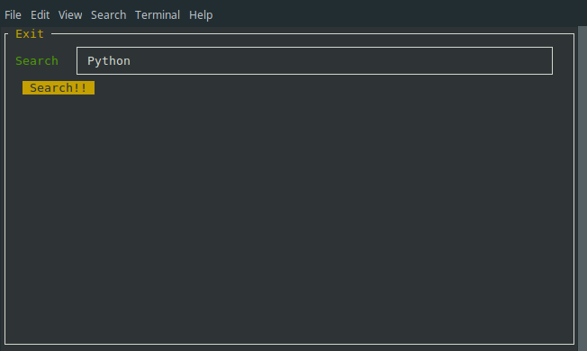
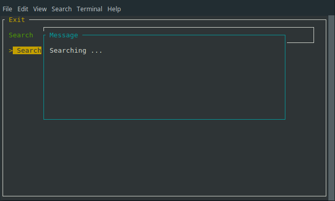
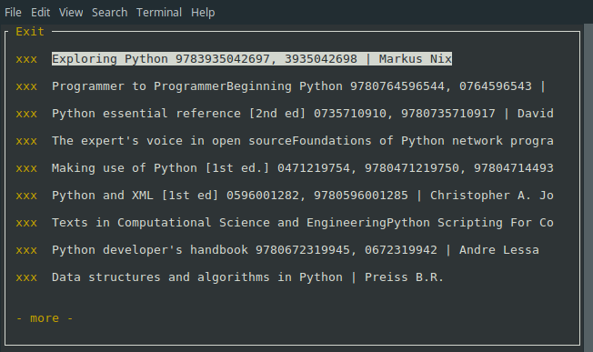
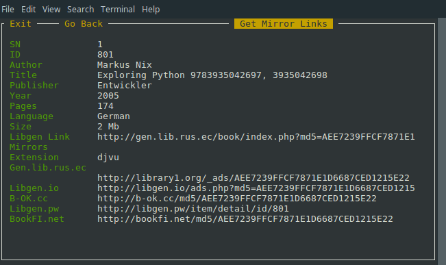
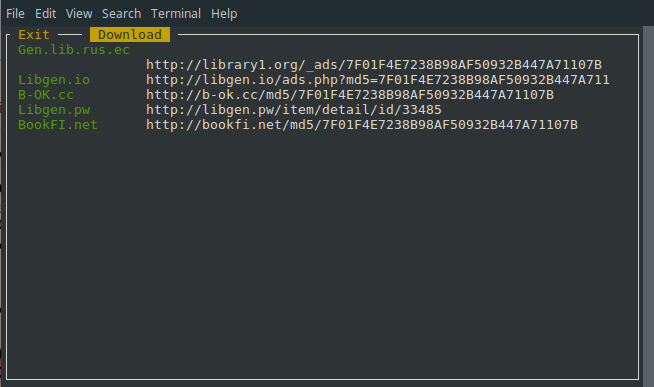
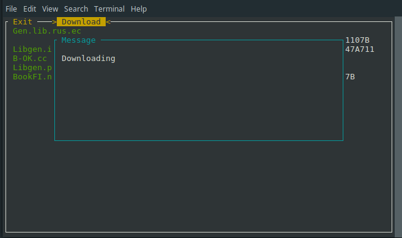
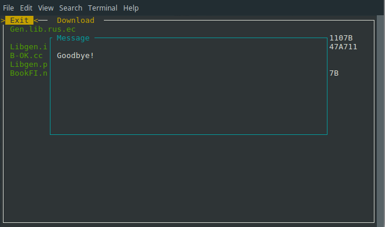

# iLibgen
## A terminal based application to browse books as well as download them.

# Installations
#### 1. Clone the repo 
     `git clone github.com/ishanrai05/iLibgen.git`
#### 2. Install virtual environment 
     `pip install virtualenv`
#### 3. Create a virtual environment 
     `virtualenv env`
#### 4. Activate the virtual environment 
     `source env/bin/activate`
#### 5. Change your current directory to iLibgen: 
    `cd iLibgen`
#### 6. Install the requirements using 
    `pip install -r requirements.txt`
#### 7. Start the app using 
    `python App.py`

#### All the downloads are saved in the Downloads directory

#### ENJOY

# Screenshots

# To-do
#### > Increse the speed
#### > Add tests
#### > Add themes
#### > Dockerize

# Disclaimer : 
For education purposes only. Using this application is not illegal but downloading paid books for free is. PEACE. 
